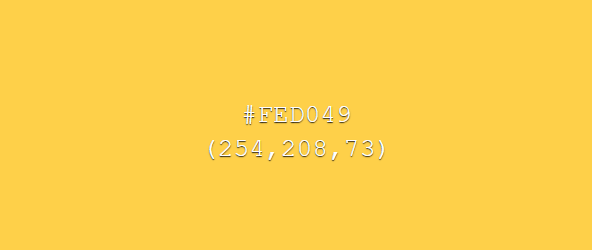
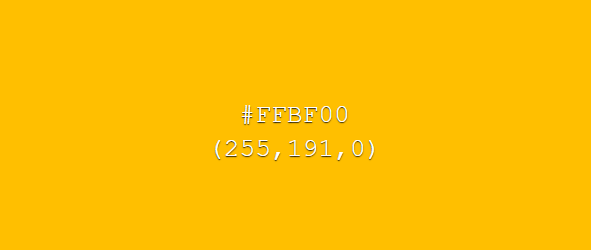
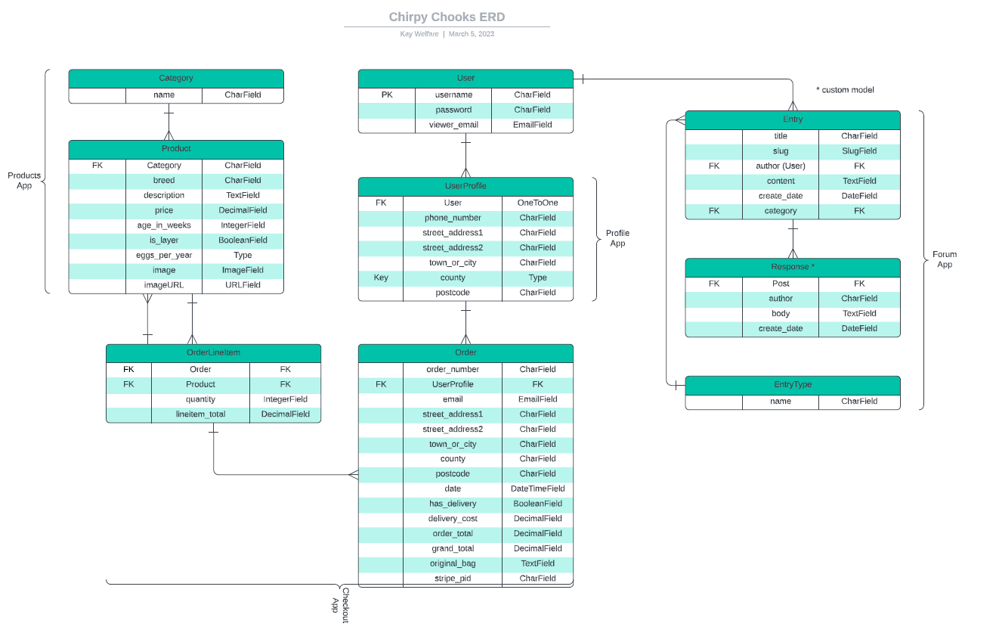

# Chirpy Chooks

This a Django based (fictional!) e-commerce application which is the last of 5 required [Code Institute](https://codeinstitute.net/ie/) portfolio projects.

Chirpy Chooks is the online store of a small business based in the West of Ireland, specialising in live poultry. The store offers a variety of laying hens, broiler chickens and laying ducks. It also offers delivery options within a certain radius (for the sake of simplicity this is based on counties rather than actual distances) and otherwise in-store collections.
On their site, Chirpy Chooks also host a forum about all things poultry. Articles published by the business itself are posted on a regular basis, offering helpful advice about poultry keeping, interesting facts about different breeds or the latest recommendations on feeds, bedding, pest control, etc.

## Table of Contents

- [UI/UX](#uiux)
    - [Agile](#agile)
    - [Wireframes](#wireframes)
    - [Site Goals](#site-goals)
    - [5 Planes of UX](#5-planes-of-ux)
    - [Visual Design Choices](#visual-design-choices)

- [SEO and Marketing](#seo-and-marketing)

- [Features](#features)
    - [Existing Features](#existing-features)
    - [Future Features](#possible-future-features)

- [Database Design](#database-design)
    - [Database Model](#database-model)
    - [Custom Model](#custom-model)
    - [CRUD](#crud)

- [Technologies Used](#technologies-used)
    - [Work Environments and Hosting](#work-environments-and-hosting)
    - [Python Libraries](#python-libraries)
    - [Django Libraries](#django-libraries)
    - [Payment processing](#payment-processing)
    - [Emails/Newsletter](#emailsnewsletter)

- [Testing](#testing)
    - [Test Guide](#test-guide)
    - [Validator Testing](#validator-testing)
    - [Browser Testing](#browser-testing)
    - [Fixed Bugs](#fixed-bugs)
    - [Unfixed Bugs](#unfixed-bugs)

- [Deployment](#deployment)

- [Development](#development)
    - [Fork](#fork)
    - [Clone](#clone)
    - [Download ZIP](#download-as-zip)

- [Source Credits](#source-credits)
    - [References/Documentation/Tutorials](#referencesdocumentationtutorials)
    - [Media and Styling](#media-and-styling)
    - [Content/Data](#contentdata)

## UI/UX

The overall design of the site follows a simplistic, earthy style. This reflects the product and their usage themselves, as well as the kind of lifestyle potential customers would potentially aspire to. 

As this business is not dealing in novelty products but livestock, flashy website features are currently not implemented. This is down to the fact that most expected customers will be based in rural Ireland where internet connection is often very limited. Therefore the site should not be bloated with features that serve no purpose other than being showy.

### Agile

This project was designed and built using the agile approach. Right from the initial planning through to final development. To help visualise the process I created a [GitHub project](https://github.com/users/Kathrin-ddggxh/projects/8) and utilised the provided Kanban board method to split project elements into user stories and manageable tasks.

To view all user stories including their required acceptance criterias and tasks, refer to the project linked to above.
Each story also has been tagged with a label to signify how crucial a particular feature is to the overall workings and acceptability of the site.

### Wireframes

The initial [wireframes in Figma](https://www.figma.com/file/nwqbwNDvflu8tDjm4krxMq/Chirpy-Chooks?node-id=0%3A1&t=hiKzdsdeGZce4shs-1) are an overly simplified version of the finished product and merely served the purpose of listing most of the site's essential features.

Not all features and functions are covered by these first drafts. For a full list of existing features see [Features](#features)

    

        Wireframe images
    

    
    
    
    
    
    
    
    
    
    
    

### Site Goals

This site is the online shop of the fictional supplier of live poultry "Chirpy Chooks". This business is based in county Clare, Ireland and is aiming to cover a customer base in the whole mid-western region of Ireland. Mainly counties Limerick, Clare and Galway.

On the site, customers can view different types of poultry the business breeds and offers. Poultry can be ordered and paid for via an intuitive, straight forward process. As the products are livestock, this business can not offer shipping. The customers are informed that orders must be collected from the business farm.

"Chirpy Chooks" is very keen as a business to provide past and future customers with useful advise and support about poultry keeping. As well as general contact details, the shop's site also features a forum maintained by the business itself, where all visitors of the site can find helpful articles on various subjects related to poultry keeping.

### 5 Planes of UX

#### Strategy

Addresses user's needs and product objectives.
The user here has been identified as a person residing in the mid-western region of Ireland who is interested in or already is keeping poultry.
Their needs are therefore a selection of different types of poultry (with different purposes), an easy way of making a selection from those and a simple payment method along with the selection process. 
Outside of the purchasing needs, the user might also require advise and information on the products offered by the business. This is addressed in the site's forum page.

*Site owner user:*

The owner of the site (or business employee) wants to be able to maintain the site without effort and via an appealing UI.

#### Scope

Addresses what functions and features are within the scope of the project.
Basic and essential e-commerce functionality was key to this project. This means that most features included are a basic requirement. Features like user sign up and login, user profile creation, checkout functionality and secure online payment had to be implemented, as well as basic CRUD funtionality for authorised users. For detailed explanation of all existing features see [Existing Features](#existing-features).
Features discussed under [Future Features](#possible-future-features), while still within the possible scope of this project, were deemed unnecessary at this point in time.

*Site owner user:*

To meet the site owners basic needs, each product can be easily updated or deleted via the front-end interface. New products can also be added via the front-end. Forum posts are handled the same way. All these features are only accessible to authorised users.

#### Structure

Defines how users can navigate the site and utilise all existing features.
The structure of the site is modelled on a basic e-commerce application with an additional forum page.
The structure allows users to browse products and make purchases as well as visit the forum to find information about poultry. Authenticated users can store their personal information in a user profile for the purpose of faster order handling.

*Site owner user:*

All CRUD functionality is placed intuitively with the relevant features of the site (individual products, forum posts). A super-user can avail of the same navigation options as as any authenticated users. However, these include additional features limited to authorised users.

#### Skeleton

Puts features defined in structure into navigational elements.
For a first outline of the project skeleton see [Wireframes](#wireframes).
To guarantee intuitive navigation of the site, both the navbar and the main content follow a standard layout pattern that should be familiar to most users.
The navbar provides links to the main features and functions of the site, varying based on whether a user is authenticated or not. On small to medium screen sizes a drop-down burger menu takes the place of the full navbar. A second-option home button is in place as a small logo, opposite all other nav links. According to research, this is also common practice.
The shopping basket link in the navbar is being updated everytime a user adds an item (of a differnt type!) to the basket.
Products and categories, as well as forum posts are listed in a card-style display.
All forms are cleary labelled an inform the user of invalid fields. User feedback is represented throughout the whole site via alert pop-ups.
Buttons and links are appropriately named.
A footer with social media links (currently merely serve as placeholders) completes the "framing" effect of the site.

#### Surface

Addresses visual design and how to convey desired emotions and achieve desired effects.
For more detail on the planning of the surface plane, see [Visual Design Choices](#visual-design-choices).

### Visual Design Choices

**Colour Scheme:**

The site utilises one accent colour (``primary-color: #FED049``) and a slightly darker gradient of the same colour (``primary-color-dark: #ffbf00``) for the purpose of focusing in on elements. The colour was chosen for its warm, earthy quality, somewhat reminiscent of egg yolk. It also offer high enough colour contrast when used with a font colour of black and is therefore in keeping with accessibility standards.

**Fonts:**

One extravagant font ("Pacifico") was chosen solely for the shops logo and can be found throughout the site where name branding is used.
The main font ("Varela Round") combines ease or readability with friendly appearance. 
For full despcription of font names and their sources see [Media and Styling](#media-and-styling)

**Images and Icons:**

All images of this site are purely related to the products offered in the store or relevant to the individual forum post. Apart from the banner image on the home page, the site refrains from using too many decorative elements.
Icons used for the purpose of navigation are standards symbols which should be familiar to most users.
For full despcription of all images and their sources see [Media and Styling](#media-and-styling).

## SEO and Marketing

For an extensive overview of the marketing research for this project, please refer to this [SEO and Marketing documentation](MARKETING.md)

## Features

### Existing Features

### Possible Future Features

**Extended product range**

The shop has the potential to extend its product range to non-livestock products, such as bird coops, feed, bedding and miscellaneous.
For the purpose of this project however, it was unnecessary to implement such a broad product database.

**Automated pick-up date selection**

Currently, the arrangment of a date for product collection is handled manually by shop employees via email or phone contact directly with the customer after order completion.
This could be automated by including calendar element with date picker option to be used after an order is complete.

## Database Design

### Database Model

The database model diagram was designed using [Lucidchart](https://lucid.app/lucidchart/dbaa86b5-9b37-4a80-a6f2-ed5048ab2100/edit?viewport_loc=-239%2C119%2C2609%2C1105%2C0_0&invitationId=inv_4bfac1de-d676-4e14-8e5d-9513944644e4).
The first draft of the entity relationship diagram does not include all models used in the final database.

### Custom Model

### CRUD

## Technologies Used

### Work Environments and Hosting

- [Figma](https://www.figma.com/) (Wireframes)
- [Lucid](https://lucid.app/) (ERD diagrams)
- [GitHub](https://github.com/) (Version control)
- [GitPod](https://gitpod.io/) (IDE)
- [Heroku](https://heroku.com/) (Site hosting)
- [AWS - Amazon Web servises (S3)](https://aws.amazon.com/) (Hosting static and media files)

### Python Libraries

- [pyscopg2](https://pypi.org/project/psycopg2/) (PostgreSQL Database adapter)
- [Pillow](https://pypi.org/project/Pillow/) (Python Imaging Library)

### Django Libraries

- [django-allauth](https://django-allauth.readthedocs.io/en/latest/) (User authentication)
- [django-crispy-forms](https://django-crispy-forms.readthedocs.io/en/latest/) (Control rendering behaviour of Django forms)
- [Bootstrap5 template pack for django-crispy-forms](https://pypi.org/project/crispy-bootstrap5/)
- [django-summernote](https://github.com/summernote/django-summernote) (WYSIWYG HTML editor)

### Payment processing

- [Stripe](https://stripe.com/) (Online payment platform)

### Emails/Newsletter

- [Gmail](https://mail.google.com/) (Real email sending)
- [Mailchimp](https://mailchimp.com/) (Automated newsletter subscription service)

## Testing

### Test Guide

For extensive instructions on how to manually test this site and it's user stories, please refer to these [testing instructions](TESTING.md)

### Fixed bugs

- **Placeholder for County dropdown list in checkout form**:

    Placeholder "County *" for the dropdown menu in checkout form is not displaying in muted colour.

    **Fix**:

- **"Full Name" field in checkout not auto-filled**:

    In the checkout view, the "Full Name" field remains blank in the payment form when the rest of the form is pre-populated with the user's saved informations.

    **Fix**:

- **Payment form submits without "County" field filled in**:

    In the checkout view, the "County" field of the payment should be required. However, the form submits even without filling in the field.

    **Fix**:

- **Verbose name in "Entry" model not working**:

    In forum app, the model ``Entry`` has an added Meta class to set the verbose name in the admin interface to the correct plural "Entries". The name in the admin panel however shows "Entrys".

    **Fix**:

- **``alt`` attribute on forum post image**:

    The value for the ``alt`` attribute on images attached to forum posts needs to be descriptive to adhere to accessibility standards.

    **Fix**:

    Create ``get_img_alt_value`` helper function in ``Entry`` model of forum app.

## Deployment

This project was deployed using [Heroku](https://heroku.com/), [ElephantSQL](https://www.elephantsql.com/) and [AWS](https://aws.amazon.com/). For a full list libraries refer to [Technologies Used](#technologies-used).

## Development

The following options are available to work with this code or run in a local environment.

### Fork

Any changes made to a forked repository do not affect the original repository.

- Log into GitHub and click on repository to download ([chirpy_chooks](https://github.com/Kathrin-ddggxh/chirpy_chooks))
- Click the **Fork** buttonin the top right-hand corner
- Select a different owner if necessary
- Click **Create Fork**
- The repo is now in your chosen account and can be cloned or changed

### Clone

Changes made to a cloned repository will affect the original one.

- Navigate to the main page of the repostitory (this could be a forked instance)
- Click on the **Code** dropdown menu above the list of files
- Choose a method to copy the URL for the repository: either via **HTTPS**, by using an **SSH key**, or by using **GitHub CLI**
- In your work environment, open Git Bash and change current directory to target location for cloned repository
- Type ``git clone`` followed by the copied URL and press enter **Enter**

### Download as ZIP

- Log into GitHub and click on repository to download ([chirpy_chooks](https://github.com/Kathrin-ddggxh/chirpy_chooks))
- Select **Code** and click "Download Zip" file
- Once download is completed, extract ZIP file and use in your local environment

## Source Credits

### References/Documentation/Tutorials

**General**:

The official [Django Documentation](https://docs.djangoproject.com/en/4.1/) was used throughout creating this project.
The skeleton of this project is based on the [Code Institute](https://codeinstitute.net/ie/) tutorial ["Boutique Ado"](https://github.com/Code-Institute-Solutions/boutique_ado_v1/tree/250e2c2b8e43cccb56b4721cd8a8bd4de6686546).

**Basket tools**:

[Django Docs on creating custom template tags](https://docs.djangoproject.com/en/4.1/howto/custom-template-tags/)

**Basket items count display in navbar**:

The syntax for displaying the amount of items currently in the shopping basket was taken from this [FeelFreeToCode tutorial](https://www.youtube.com/watch?v=3xQRJqxdgK4&ab_channel=FeelFreeToCode)

**User alerts (toasts/messages)**:

The live feedback messages to alert user actions were implemented using the [Django message framework](https://docs.djangoproject.com/en/4.1/ref/contrib/messages/) and the respective [message levels](https://docs.djangoproject.com/en/4.1/ref/contrib/messages/).

The alert pop-up frames were rendered using [Bootstrap 5 toasts](https://getbootstrap.com/docs/5.0/components/toasts/).

**Custom error pages**:

To implement custom error pages in Django I followed this [Cryce Truly tutorial](https://www.youtube.com/watch?v=3SKjPppM_DU&ab_channel=CryceTruly)

### Media and Styling

**Images:**

*freerange-hens.jpg*: Me! (Kay Welfare)

*rhode-island-red.jpg:* https://poultrypaddock.co.uk/wp-content/uploads/2017/11/blacktail1-1.jpg

*bluebell.jpg:* https://poultrypaddock.co.uk/wp-content/uploads/2017/11/Bluebell3_1.jpg

*light-sussex.jpg:* https://poultrypaddock.co.uk/wp-content/uploads/2017/11/sussex3.jpg

*blackrock.jpg:* https://poultrypaddock.co.uk/wp-content/uploads/2017/11/blackrock4.jpg

*copper-black-maran.jpg:* https://poultrypaddock.co.uk/wp-content/uploads/2017/11/maran.jpg

*white-leghorn.jpg:* https://poultrypaddock.co.uk/wp-content/uploads/2017/11/Leghorn1_1.jpg

*broiler-chicken.png:* https://thefewellhomestead.com/broiler-chicken-breeds-16-of-the-best-meat-chickens/

*aylesbury-duck.jpg:* https://www.thehappychickencoop.com/aylesbury-duck/

*khaki-campbell.jpg:* https://livestockconservancy.org/wp-content/uploads/2022/08/Campbell-Pair.jpg

*ancona-duck.jpg:* https://www.breedslist.com/wp-content/uploads/2016/10/Ancona-Duck.jpg

*laying-hen.jpg:* https://learnpoultry.com/best-egg-laying-chickens/

*broiler.jpg:* https://vegsoc.org/info-hub/why-go-veggie/animals/broiler-chickens/

*laying-duck.jpg:* https://www.thehappychickencoop.com/raising-ducks-for-eggs/

*noimage.png:* https://upload.wikimedia.org/wikipedia/commons/thumb/4/42/Chicken_cartoon_04.svg/300px-Chicken_cartoon_04.svg.png 

*chicken-question.jpg:* https://www.dreamstime.com/stock-photography-cartoon-chicken-doubt-yellow-little-bird-speech-bubble-question-mark-image30411162

All images used in the **Facebook mock-up business page** are my own, taken by myself of my own chickens!

**Fonts:**

All fonts were taken from [Google Fonts](https://fonts.google.com/).

*Pacifico*: Designed by Vernon Adams, Jacques Le Bailly, Botjo Nikoltchev, Ani Petrova

*Varela Round*: Designed by Joe Prince

**Icons:**

All icons were taken from [Iconify](https://icon-sets.iconify.design/). Included in this is the animated loading spinner icon of the checkout page.

### Content/Data

All fixtures for the products app were manually compiled with data gathered from various online resources.

**All layer breeds**: https://www.freewaypoultry.ie/product-category/live-poultry/point-of-lay-pullets/

**Broiler (Cornish Cross)**: https://thefewellhomestead.com/broiler-chicken-breeds-16-of-the-best-meat-chickens/

**All duck breeds**: https://petkeen.com/best-egg-laying-duck-breeds/

